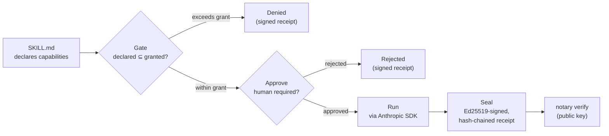

# notary

**A black-box recorder and approval gate for any Claude skill. Signed, tamper-evident, human-approved execution receipts. Drop-in MCP server, no infra, under 1,500 lines.**

A solicitor lets an AI skill read a client matter, draft a clause, flag a risk. Later someone asks: what was that skill *allowed* to touch? Did a qualified human *approve* it before it ran? Can you prove the record of what happened has not been edited since?

In a regulated setting — legal, finance, healthcare — "trust me, it logged it" is not an answer. `notary` makes the answer provable.

Point it at a skill folder. It checks the skill's declared permissions against what you granted, optionally pauses for a human to approve, runs it, and writes an **Ed25519-signed, hash-chained receipt** of everything that happened. Anyone with the public key can verify a receipt is genuine. **Nobody can forge, alter, reorder, or truncate a sealed receipt without the private signing key.**

No database. No auth server. No dashboard. No hosting. Those are your job, and that is the point. notary works for any Claude skill; legal is where the receipt matters most.

> **Audit quality → audit security → notarise execution.** [skill-auditor](https://github.com/b1rdmania/claude-skill-auditor) checks whether a skill is any good; [skill-security-audit](https://github.com/b1rdmania/skill-security-audit) checks whether it is safe to run; `notary` proves what it was allowed to do, and that a human approved it, every time it runs.


## Quick start

```bash
npx @b1rdmania/notary run examples/skills/contract-review --doc nda.txt
```

```
✓ skill loaded: contract-review
✓ gate: declared [fs.read, model.call] ⊆ granted [fs.read, model.call]
? approve "contract-review" to run with [fs.read, model.call]? [y/N] y
✓ approved by cli
… running …
─ output ───────────────────────────────────────────
  6 issues found in nda.txt (see summary)
────────────────────────────────────────────────────
✓ receipt sealed & signed: 7 entries → .notary/receipts.jsonl
  signed by key 81917d5862cd0b94
  pin this head to detect truncation: 37476b5b36929d91…
  verify with:  notary verify
```

```bash
npx @b1rdmania/notary verify
```
```
OK — 7 entries, chain intact. 1 signed receipt verified
```

## The flow



Every path ends in a signed receipt, including a denial or a rejection. A run that was blocked is itself a recorded, provable fact.

## How it works — 5 steps

1. **Load** — a skill is a folder with a `SKILL.md` and a small front-matter manifest declaring its `capabilities`: what it may read, write, or call.
2. **Gate** — are the declared capabilities a subset of what you granted? Declare more than you allowed and it is denied. Nothing runs. (notary gates declared *intent*; it does not itself sandbox the model's tool access. Wiring capabilities to a real sandbox is the forker's job.)
3. **Approve** — if the skill or your policy requires it, a pluggable hook pauses for a human. The default is a CLI prompt; swap in a webhook or Slack.
4. **Run** — the skill executes via the Anthropic SDK. Inputs, model, token usage, and an output hash are captured.
5. **Seal** — every step is appended as a hash-chained entry, and the receipt is signed with an Ed25519 key. `notary verify` re-walks the chain and checks the signature.

## Try to forge it

This is the test that matters for a security primitive, so run it yourself. Edit any past entry in the receipt and recompute every hash forward, so the chain is internally consistent again:

```bash
npx @b1rdmania/notary verify
```
```
BROKEN at seq 6 — invalid signature (the receipt was forged or altered after signing)
```

A plain hash chain cannot stop that. The forger just recomputes the chain. The signature can, because they do not have the key. See `test/signing.test.ts` for the attacks, run against the real code.

## The receipt — and exactly what it guarantees

Append-only `./.notary/receipts.jsonl`, one line per event. The final `receipt.sealed` line carries the signature:

```json
{ "seq": 6, "ts": "...", "runId": "...", "event": "receipt.sealed", "skill": "contract-review",
  "payload": { "status": "completed", "runCount": 7, "runFinalSeq": 6, "runHeadHash": "…",
               "signature": "…", "keyId": "81917d58…" }, "prevHash": "…", "hash": "…" }
```

Two layers, and it is worth being precise about what each buys you:

- **The hash chain** (`hash = sha256(canonicalJSON(entry-without-hash))`, each `prevHash` linking to the prior `hash`) detects accidental corruption and naive edits: anything that leaves a stale hash or a broken link.
- **The Ed25519 signature** is the part that matters against a real adversary. A hash chain alone does **not** stop someone who can rewrite the whole file and recompute every hash forward. The signature does: the seal is signed over its full content and the chain head, with a private key the verifier never holds. **You cannot produce a valid sealed receipt — forged, altered, reordered, or with entries added or removed — without that key.**

### Threat model, stated honestly

- ✅ Forge or tamper with a sealed receipt's contents → caught (bad signature).
- ✅ Add, remove, or reorder entries within a sealed run → caught (committed count/head + signature).
- ✅ Truncate the tail of the file → caught **if you pinned the head** (`notary` prints it after every run; verify with `--head <hash>`).
- ⚠️ Delete an entire sealed receipt from a *collection* of receipts → a single signed receipt can't prove a sibling was deleted. For that, pin the latest head out-of-band or publish heads to an append-only / transparency log. notary gives you the pinnable head; where you anchor it is your call.

The guarantee is **"unforgeable without the signing key,"** not magic. Keep the private key off the machine that ships receipts to be verified, and hand out only the public key.

## Keys — zero infra

On first run, notary generates a local Ed25519 keypair: the private key goes to `.notary/notary.key` (mode `0600`, gitignored — keep it secret), the public key to `.notary/notary.pub` (share it). In production, supply your own private key via `NOTARY_PRIVATE_KEY` (base64 PKCS8 DER) and store it wherever you keep secrets. No KMS, no service.

```bash
notary verify receipts.jsonl --pubkey <base64>   # verify with a key you were given
notary verify receipts.jsonl --head <hash>       # also assert the file wasn't truncated
```

## As an MCP server

`notary` exposes `run_skill` and `verify_receipt` over MCP, so Claude Desktop, Cursor, or any MCP client can run skills through the same gate → approve → seal path.

```json
{
  "mcpServers": {
    "notary": { "command": "npx", "args": ["@b1rdmania/notary", "mcp"] }
  }
}
```

**Approval over MCP:** there is no terminal to prompt on, so notary does *not* silently auto-approve. That would break the human-approved guarantee. The caller must assert a human approved by passing `approve: true` to `run_skill`. Without it, a skill that requires approval is recorded as **rejected** and does not run. Wire `approve` to a real confirmation, a UI button or a Slack action, in your integration.

## In a legal workflow

This is the use case notary was built for. The `contract-review` example shows the shape:

- A skill declares it may read the matter and call the model, nothing else. The **gate** proves it never had write or network access.
- The skill requires approval, so a **qualified human** signs off before it runs, and the signer is recorded.
- The output is advisory: issues flagged for a human, never "this contract is safe."
- The **signed receipt** is the artefact you hand an auditor, a regulator, or opposing counsel. It shows what ran, on what, who approved it, and proof the record is intact.

It is the supervision-and-evidence layer under tools like [claude-for-uk-legal](https://github.com/b1rdmania/claude-for-uk-legal) and [Legalise](https://github.com/b1rdmania/legalise): run the legal skill, gate it, get a solicitor's sign-off, keep the proof.

Swap in any skill and it runs the same way. The `summarise` example is non-legal. notary does not care what the skill does; it cares that you can prove what it was allowed to do and that a human stood behind it.

## What notary deliberately is *not*

No users, no multi-tenancy, no database, no web UI, no config framework, no plugin system, no skill-authoring tools, no execution sandbox. One job, forever. Everything else is the forker's job. Fork it and build your product on top.

## Develop

```bash
npm install
npm test          # vitest — includes the forgery attacks in test/signing.test.ts
npm run build     # tsc → dist/
npm run dev -- run examples/skills/summarise --input "some text" --yes
```

Running a skill for real needs an Anthropic API key (`ANTHROPIC_API_KEY`). You bring your own; notary never ships one.

## License

MIT.
